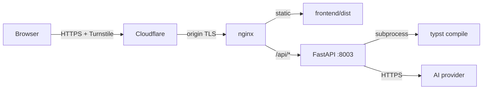

# Resume Builder

AI-assisted resume builder with seven Typst-rendered themes, structured bullet polishing, and one-click PDF export.
Live demo: **[cv.zolanvari.com](https://cv.zolanvari.com)** · MIT licensed.

> Screenshots and the live demo link will be added here once `cv.zolanvari.com` is deployed. The flow: click **Try sample resume** → switch theme → polish a bullet (transparent diff, accept / reject) → download PDF.

## What it does

- **Start three ways**: upload a PDF (or paste text) and let the AI extract structured fields, click a sample résumé to see all seven themes instantly, or build from a blank form.
- **Edit any field** in the guided builder — collapsible section cards for Contact, Experience, Education, Skills.
- **Polish individual bullets** with AI. Each polished bullet comes back with a structured diff — the rewritten text, which weasel words were removed, whether a metric should be added, and a one-line rationale. Accept or reject per bullet.
- **Visual theme picker**: real miniatures of all 7 themes, click to swap. The preview re-renders server-side.
- **One-click PDF download** of the current resume + theme.

## Tech stack

| Layer | Choice |
|---|---|
| Backend | Python 3.11 · FastAPI · uvicorn |
| Rendering | Typst v0.14.2 (pinned in Docker) |
| AI | Provider-agnostic `AIProvider` ABC; single concrete impl behind `services/ai/factory.py` |
| Frontend | React 18 · Vite · TypeScript · Tailwind |
| Infra | Docker · nginx · Cloudflare (TLS + Turnstile) |

## Architecture



See [docs/architecture.md](docs/architecture.md) for the request-flow walkthrough, the boundary between modules, and the privacy and cost-control posture.

## Privacy

This demo does not store résumés. There is no database. Form content is sent to the server only when you click **Update preview** or **Polish**, processed in a per-request temporary directory, and discarded as soon as the response returns. The AI provider sees the bullet text for the bullets you choose to polish; nothing else.

If you submit the optional **Subscribe** form, your name and email are kept only to send the product updates you opted in to receive. Unsubscribe anytime.

## Cost and abuse posture

Three layered defenses on a public AI endpoint:
1. **Cloudflare Turnstile** with server-side Siteverify on `/api/polish`.
2. **Per-IP rate limit** via `slowapi` (10 polish / 60 render per hour by default; tunable via env).
3. **Instant kill switch**: `AI_ENABLED=false` in env → `/api/polish` returns 503, render and download still work.

GCP / provider budgets are alerts, not ceilings. The above is what actually caps cost on a public demo.

## Local development

```bash
git clone https://github.com/zolanvari/resume.git
cd resume
cp .env.example .env       # add GEMINI_API_KEY + TURNSTILE_SECRET_KEY (optional for local)
docker compose up -d --build
cd frontend && npm ci && npm run dev
```

Backend listens on `127.0.0.1:8003`. Vite dev server proxies `/api/*` to it. To enable AI polish locally, fill `GEMINI_API_KEY`; without it the endpoint returns a clean 503 and the rest of the demo still works.

To enable Cloudflare Turnstile locally, set `VITE_TURNSTILE_SITE_KEY` in `frontend/.env` and `TURNSTILE_SECRET_KEY` in `.env`.

## API

<details>
<summary>Endpoints</summary>

| Method | Path | Body | Response |
|---|---|---|---|
| `GET`  | `/health`     | — | `{status, typst, ai_enabled}` |
| `GET`  | `/api/sample` | — | `ResumeData` |
| `POST` | `/api/render` | `{resume, theme}` | `application/pdf` |
| `POST` | `/api/polish` | `{resume, bullet_ids, tone, turnstile_token}` | `{polished: PolishedBullet[]}` |
| `POST` | `/api/parse`  | multipart `file` (PDF/txt) **or** `text`, plus `turnstile_token` | `ResumeData` |
| `POST` | `/api/subscribe` | `{name, email, consent, turnstile_token}` | `{ok: true}` |

`PolishedBullet`:
```
{
  bullet_id, original, rewritten,
  action_verb_changed: bool,
  quantification_needed: bool,
  weasel_words_removed: string[],
  explanation: string
}
```
</details>

## Project layout

```
backend/
  app/
    main.py                    FastAPI app, rate-limit middleware
    schemas.py                 Pydantic models (single source of truth)
    sample_data.py             Canonical sample served by /api/sample
    routers/                   One file per endpoint
    services/
      typst_emit.py            Pure: ResumeData → .typ source string
      typst_render.py          Subprocess: .typ → PDF bytes
      turnstile.py             Server-side Siteverify
      ai/
        provider.py            AIProvider ABC
        factory.py             One-line swap point
        gemini.py              Concrete implementation
    prompts/polish.md          Source of truth for polish behaviour
    templates/resume.typ       Forked from modern-cv, theme-extended
frontend/
  src/
    App.tsx                    Layout + state
    PolishContext.tsx          Pending polishes, in-flight, accept/reject
    components/                Form, theme picker, preview, bullet editor…
```

## Author

**Iman Zolanvari** · [LinkedIn](#)

## Attribution

The Typst template is forked from [ptsouchlos/modern-cv](https://github.com/ptsouchlos/modern-cv) under the MIT license. See [LICENSE](./LICENSE).
