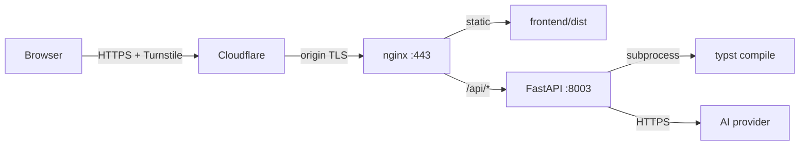

# Architecture

## Request flow

1. **Static**: browser fetches the SPA shell from `nginx`, which serves files out of `frontend/dist/`.
2. **Sample**: SPA calls `GET /api/sample` for a canonical resume; renders the form pre-filled. No network egress required from the backend.
3. **Render**: SPA `POST /api/render` with `{resume, theme}`; FastAPI calls `services.typst_emit.emit_typst` to produce a Typst source file, drops it in a `tempfile.TemporaryDirectory` alongside `resume.typ` and `graphite-paper.jpg`, then invokes the pinned `typst` CLI with `--font-path /usr/share/fonts`. PDF bytes stream back as `application/pdf`. Temp dir is removed.
4. **Polish**: SPA `POST /api/polish` with `{resume, bullet_ids, tone, turnstile_token}`. Backend (a) verifies Turnstile via Cloudflare Siteverify, (b) checks the per-IP rate limit, (c) calls the AI provider via the `AIProvider` abstraction, (d) returns structured `PolishedBullet[]` objects (original, rewritten, diff metadata, explanation).

## Boundaries

- **Pure data → Typst** in `services/typst_emit.py`. No I/O, no rendering — easy to unit-test.
- **Stateless render** in `services/typst_render.py`. Each request gets a fresh temp dir.
- **AI provider abstraction** in `services/ai/provider.py` (the `AIProvider` ABC) with a single concrete implementation under `services/ai/`. The factory in `services/ai/factory.py` is the swap point; replacing the LLM is one file's worth of work.
- **Frontend never knows the AI provider's name.** It calls `/api/polish` and renders the structured diff response.

## Privacy

There is no database. Resumes are processed in-memory and in per-request temp directories that get cleaned up automatically. The polish endpoint sends bullet text to the configured AI provider over HTTPS; nothing is persisted on the backend.

## Cost controls

- App-level rate limits via `slowapi` (per-IP, hourly).
- Cloudflare Turnstile on `/api/polish` with **server-side Siteverify**.
- Request body size caps (`MAX_RESUME_CHARS`, `MAX_PDF_MB`).
- `AI_ENABLED` env toggle kills `/api/polish` instantly without redeploying.
- AI provider's own API-key quota as the final ceiling.
